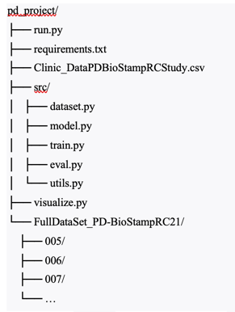

# Launch Instructions
The project requires a Python environment with the torch, numpy, pandas, scikit-learn, matplotlib, and tqdm libraries, which are listed in requirements.txt and used in all key pipeline modules.

The expected directory structure is as follows:

The data_root passed to run.py must point to the directory containing both Clinic_DataPDBioStampRCStudy.csv and the FullDataSet_PD-BioStampRC21 folder.

Dependencies are installed using the standard command:

pip install -r requirements.txt

Training is launched with the following command:

python run.py train \
  --data_root /path/to/pd_project \
  --clinic_file Clinic_DataPDBioStampRCStudy.csv \
  --window_sec 10 \
  --stride_sec 5 \
  --batch_size 8 \
  --lr 3e-4 \
  --epochs 50 \
  --checkpoint_dir checkpoints \
  --val_size 0.20 \
  --test_size 0.20

After training, the best model is saved to checkpoints/best_model.pt inside the directory specified by --checkpoint_dir.

Evaluation of the trained model is launched with:

python run.py eval \
  --data_root /path/to/pd_project \
  --clinic_file Clinic_DataPDBioStampRCStudy.csv \
  --window_sec 10 \
  --stride_sec 5 \
  --batch_size 32 \
  --checkpoint_dir checkpoints

To use a specific checkpoint, pass --checkpoint_path; otherwise run.py defaults to checkpoints/best_model.pt.

Visualization is launched with:

python visualize.py \
  --data_root /path/to/pd_project \
  --clinic_file Clinic_DataPDBioStampRCStudy.csv \
  --val_size 0.20 --test_size 0.20 \
  --split test --out_dir figures

Results are saved to figures/ as five PNG files: ROC curve, Precision-Recall curve, window-level confusion matrix, patient-level confusion matrix, and a bar chart of per-patient PD probabilities.